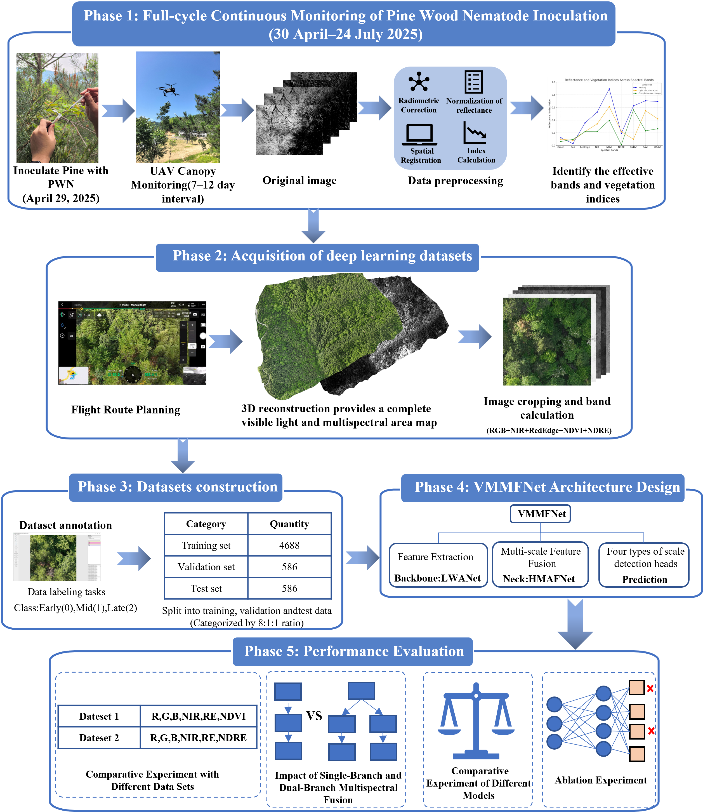

# VMMFNet: A Lightweight Dual-Branch Multispectral Fusion Network for PWD Detection

**VMMFNet: A Lightweight Dual-Branch Multispectral Fusion Network for Multi-Stage Detection of Pine Wilt Disease**

[](https://opensource.org/licenses/MIT)
[](https://www.python.org/downloads/)
[](https://pytorch.org/)

---
---

## 🧠 Model Architecture: VMMFNet

The architecture of **VMMFNet** is engineered to address the specific challenges of early-stage PWD detection by integrating three specialized components:


### Core Components:

1. **LWANet Backbone (Lightweight Attention Network)**
   * **Dual-Branch Structure**: Efficiently decouples and processes key features from redundant information.
   * **LWABlock & MSAA**: Embeds Multi-Scale Attention Aggregation to enhance weak lesion signals while maintaining a lightweight profile.

2. **HMAFNet Neck (Hierarchical Multi-Scale Attention Fusion)**
   * **HLAF Mechanism**: Leverages high-level semantics to guide low-level feature fusion, effectively suppressing complex background noise in forest environments.

3. **Micro-target Prediction Heads**
   * **Stride-4 Detection**: Extends the detection hierarchy to high-resolution shallow features.
   * **Multi-Scale Robustness**: Enables high-precision detection across extreme scale variations, from minute needle discoloration ($4 \times 4$ pixels) to late-stage crown decline.


---

## 🛰️ Overall Research Design and Workflow

To provide a clear understanding of the study, the complete experimental pipeline—from biological inoculation to model evaluation—is summarized in the figure below:



### Workflow Description:
The study is organized into five systematic phases:
1. **Phase 1: PWN Inoculation & Monitoring**: Continuous monitoring of pine trees inoculated with Pine Wood Nematode (PWN) from April to July 2025 to identify sensitive spectral bands and vegetation indices.
2. **Phase 2: Data Acquisition**: UAV flight planning and 3D reconstruction to generate comprehensive visible (RGB) and multispectral (MS) maps.
3. **Phase 3: Dataset Construction**: Manual annotation of infection stages (Early, Mid, Late) and partitioning into training, validation, and test sets (8:1:1 ratio).
4. **Phase 4: Architecture Design**: Implementation of **VMMFNet**, featuring the **LWANet** backbone for feature extraction and **HMAFNet** neck for multi-scale fusion.
5. **Phase 5: Performance Evaluation**: Comprehensive testing including comparative experiments with different datasets, fusion strategies, and ablation studies.

---
## 🌟 Highlights

* **Experimental Grounding**: Conducted controlled PWN inoculation to identify early-stage sensitive spectral bands and vegetation indices.
* **Annotated Dataset**: Constructed a multi-stage dataset integrating synchronized UAV visible and multispectral imagery with precise annotations.
* **Lightweight Fusion (LWANet)**: Proposed a dual-branch backbone for efficient cross-modality feature extraction and lightweight fusion.
* **Noise Suppression (HMAFNet)**: Designed a specialized neck to mitigate background noise and enhance multi-scale feature representation.
* **Micro-target Detection**: Achieved robust four-scale detection optimized for tiny (**4×4 pixels**, ~3–25 cm) to large-scale PWD targets.


---

---

## 📁 Repository Structure

The project is organized to facilitate the modular implementation of multispectral fusion and ease of reproducibility:

```text
.
├── Experiments/               
│   └── Ablation/
│   └── Comparative Experiment of Different Models/
│   └── pt
│   └── Dataset Configuration.yaml
│   └── Training Configuration.yaml
│   └── train.py
├── data_processing/        # Data handling and integrity verification
│   ├── uav_dataset_construction.py # MS/RGB tiling & alignment pipeline
│   └── spatial_anti_leakage_check.py # Geographic overlap verification
├── images/                 # Visual assets for documentation
│   └── workflow.png        # Overall research design flowchart
|   └── architecture.png    # VMMFNet architecture
├── modules/                 # Neural network architecture
│   ├── LWABlock.py     # Lightweight dual-branch backbone
│   ├── HLAF.py        # Multi-scale fusion neck
│   └── MSAA.py          # Complete integrated framework
└── README.md
